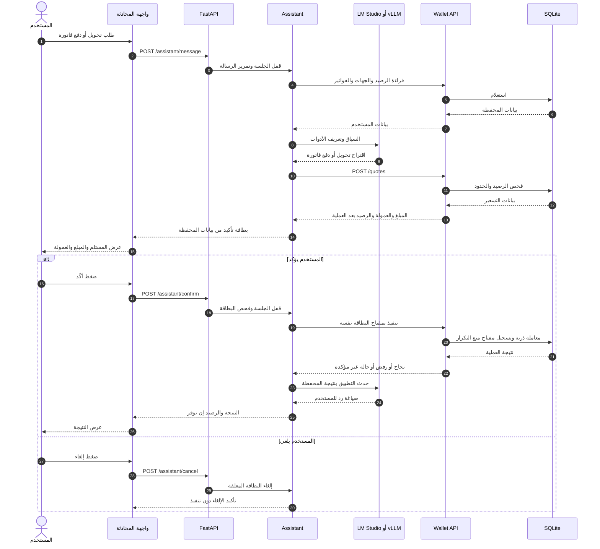

# مخطط عمل وكيل زين

**حدود المسؤولية:** الموديل يدير الحوار ويطلب إنشاء بطاقة فقط. المحفظة تحسب الأرقام وتفرض قواعد الدفع. لا تبدأ عملية الخصم إلا عند تأكيد بطاقة فعالة. يستخدم التنفيذ رقم البطاقة مفتاحًا لمنع التكرار؛ وعند انقطاع الاتصال يعيد المحاولة بالمفتاح نفسه ويفحص سجل العمليات قبل إعلان النتيجة.
